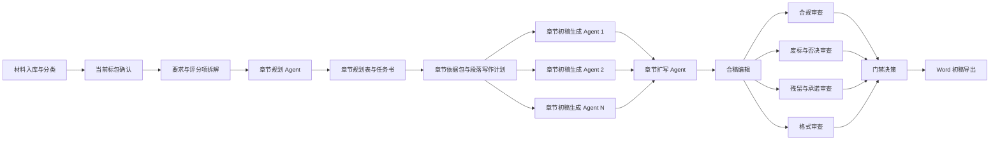

# 技术标编制 Subagent 工作台

这个仓库把技术投标文件编制拆成“总控 agent + 动态 subagent”的流水线。

核心原则不是让多个 agent 同时自由写作，而是先拆要求、再发任务书、并行写章节、独立审查、门禁通过后导出。

产品定位、架构角色、数据契约、幂等与恢复语义见 [产品化规范](docs/productized-agent-spec.md)。

## 推荐流程



## 快速开始

1. 初始化一个项目工作区：

```powershell
python scripts/bidflow.py init "项目名称" --package "标包名称"
```

2. 将招标文件、技术规范书、历史参考和支撑材料放入生成的 `projects/<项目>/sources/` 对应目录。OpenClaw 快速验证阶段的知识管理规则放在 `technical-bid-authoring` skill 的 `references/knowledge-management.md` 下；历史材料采用人工粗筛、章节/段落片段登记、去项目化清洗、三态准入的受控复用方式，不单独建设复杂片段库或系统级知识库。

3. 编辑项目目录中的 `project.json`，补充材料和人工确认项，然后解析入库资料。`ingest-sources` 会读取 `sources/` 下的 PDF、DOCX、XLSX、TXT/MD，生成 `inventory/source-index.json` 和 `inventory/source-readiness.json`。PDF/DOCX/TXT 会尽量记录页码或章节路径，DOCX/XLSX 表格会记录表格位置；普通 PDF 表格暂不假定可稳定抽取，核心依据中的关键表格需要人工复核。

```powershell
python scripts/bidflow.py ingest-sources "projects/<项目目录>" `
  --report "projects/<项目目录>/reviews/ingest-sources.json"
```

系统按文件用途和解析可信度分级处理：技术规范书、评分细则、技术投标格式等核心依据不可稳定解析时阻断正文生成；历史技术标、既往方案和支撑材料解析质量较低时只降低引用优先级或排除出 RAG。

```powershell
python scripts/bidflow.py check-sources "projects/<项目目录>/inventory/source-readiness.json"
```

4. 生成 subagent 执行计划：

```powershell
python scripts/bidflow.py plan "projects/<项目目录>"
```

5. 检查逐条拆解的要求、标记和废标/否决条款：

如果要求拆解由 `requirement-analyst` 或外部 LLM 先产出为一个汇总 JSON，可先用 `shred-rfp` 将其落盘为标准台账并立即复用门禁校验：

```powershell
python scripts/bidflow.py shred-rfp `
  "projects/<项目目录>" `
  "projects/<项目目录>/requirements/shred-rfp.json" `
  --report "projects/<项目目录>/reviews/shred-rfp.json"
```

```powershell
python scripts/bidflow.py check-requirements "projects/<项目目录>/requirements/atomic-requirements.json"
```

推荐同时传入标记释义表和废标/否决条款表，执行交叉校验：

```powershell
python scripts/bidflow.py check-requirements `
  "projects/<项目目录>/requirements/atomic-requirements.json" `
  --markers "projects/<项目目录>/requirements/marker-register.json" `
  --rejections "projects/<项目目录>/requirements/rejection-clauses.json"
```

评分标准存在多组适用范围时，应按逻辑来源片段确认“通用组 + 标包共用组 + 标包专项组 + 补遗覆盖组”的实际组合，不得硬编码页码，也不得把其他标包评分办法混入本标包。每个评分项必须绑定已选中的 `scoring_group_id` 和 `source_segment_id`：

```powershell
python scripts/bidflow.py check-scoring-applicability `
  "projects/<项目目录>/requirements/scoring-applicability.json" `
  --package "标包名称" `
  --scoring-map "projects/<项目目录>/requirements/scoring-map.json"
```

评分适用组确认后，还必须检查最高得分档是否已经拆成评分内容对象、质量标准和全局编写约束。评分内容对象用于生成三级标题；“全面、详细、较好”等程度词只作为写作质量标准；“结合项目建设内容”等表述作为全局约束，不得生成为目录标题：

```powershell
python scripts/bidflow.py check-scoring-map `
  "projects/<项目目录>/requirements/scoring-map.json" `
  --applicability "projects/<项目目录>/requirements/scoring-applicability.json" `
  --report "projects/<项目目录>/reviews/scoring-map-check.json"
```

每个必答要求还必须形成“招标原文 → 我司响应口径”记录。供应商义务写成“我司将……”，采购方义务写成“我司理解并配合采购方……”，禁止性要求写成“我司承诺不……”。条件、范围、数字和单位进入 `fixed_elements`，扩写边界进入 `allowed_expansion` 和 `forbidden_changes`：

```powershell
python scripts/bidflow.py check-response-register `
  "projects/<项目目录>/requirements/response-register.json" `
  --requirements "projects/<项目目录>/requirements/atomic-requirements.json" `
  --report "projects/<项目目录>/reviews/response-register-check.json"
```

例如原文“集中评审阶段不少于1人现场联络”，正文口径应为“我司将在集中评审阶段安排不少于1人负责现场联络”，不得扩成全周期驻场。

6. 章节规划完成后，先检查章节、评分项、原子要点和写作任务是否闭环：

```powershell
python scripts/bidflow.py check-plan `
  "projects/<项目目录>/planning/chapter-plan.json" `
  --requirements "projects/<项目目录>/requirements/atomic-requirements.json" `
  --scoring-map "projects/<项目目录>/requirements/scoring-map.json" `
  --response-register "projects/<项目目录>/requirements/response-register.json" `
  --report "projects/<项目目录>/reviews/plan-check.json"
```

规划通过后，由 `content-grounder` 为每个章节任务形成章节依据包和段落写作计划。两项检查全部通过，才允许派发 `chapter-realizer-*`：

```powershell
python scripts/bidflow.py check-grounding-pack `
  "projects/<项目目录>/grounding/章节.json" `
  --response-register "projects/<项目目录>/requirements/response-register.json" `
  --scoring-applicability "projects/<项目目录>/requirements/scoring-applicability.json" `
  --report "projects/<项目目录>/reviews/grounding-章节.json"

python scripts/bidflow.py check-paragraph-plan `
  "projects/<项目目录>/paragraph-plans/章节.json" `
  --grounding "projects/<项目目录>/grounding/章节.json" `
  --report "projects/<项目目录>/reviews/paragraph-plan-章节.json"
```

7. 按阶段运行门禁检查：

```powershell
python scripts/bidflow.py validate "projects/<项目目录>" --stage requirements
python scripts/bidflow.py validate "projects/<项目目录>" --stage planning
python scripts/bidflow.py validate "projects/<项目目录>" --stage grounding
python scripts/bidflow.py validate "projects/<项目目录>" --stage drafting
python scripts/bidflow.py validate "projects/<项目目录>" --stage expansion
python scripts/bidflow.py validate "projects/<项目目录>" --stage review
python scripts/bidflow.py validate "projects/<项目目录>" --stage export
```

章节初稿完成后，先检查是否严格按照任务书标题树、评分项和证据链落位：

```powershell
python scripts/bidflow.py check-chapter-draft `
  "projects/<项目目录>/tasks/chapter-task-001.json" `
  "projects/<项目目录>/chapters/章节初稿.md" `
  --evidence "projects/<项目目录>/evidence/章节初稿.json" `
  --grounding "projects/<项目目录>/grounding/章节.json" `
  --paragraph-plan "projects/<项目目录>/paragraph-plans/章节.json" `
  --report "projects/<项目目录>/reviews/chapter-draft-001.json"

python scripts/bidflow.py check-responses `
  "projects/<项目目录>/requirements/response-register.json" `
  "projects/<项目目录>/chapters/章节初稿.md" `
  --task "projects/<项目目录>/tasks/chapter-task-001.json" `
  --evidence "projects/<项目目录>/evidence/章节初稿.json" `
  --report "projects/<项目目录>/reviews/responses-001.json"
```

章节初稿通过后，再进入 `chapter-expander-*` 扩写深化。扩写只能增加已有对象、动作、控制点、成果和证据的细节，最多自动整改两轮。扩写完成后检查结构、比例、空话、禁用词和无来源承诺：

```powershell
python scripts/bidflow.py check-expansion "原章节.md" "扩写章节.md" `
  --evidence "章节证据.json" `
  --paragraph-plan "段落写作计划.json" `
  --report "扩写审查.json"

python scripts/bidflow.py check-responses `
  "projects/<项目目录>/requirements/response-register.json" `
  "扩写章节.md" `
  --task "章节任务书.json" `
  --evidence "章节证据.json" `
  --report "扩写响应口径审查.json"

python scripts/bidflow.py check-rejection `
  "projects/<项目目录>/requirements/rejection-clauses.json" `
  "扩写章节.md" `
  --task "章节任务书.json" `
  --evidence "章节证据.json" `
  --report "废标否决审查.json"
```

合稿后还要生成全篇响应一致性报告，供 G4/G5 门禁读取：

```powershell
python scripts/bidflow.py check-responses `
  "projects/<项目目录>/requirements/response-register.json" `
  "projects/<项目目录>/merged/technical-bid-draft.md" `
  --report "projects/<项目目录>/reviews/response-consistency.json"
```

这里的“真实展开生成器”不是一个大模型反复续写，而是受控产物串联：评分组台账限定评分边界，响应口径台账把要求转成可直接写入的我司表述，章节任务书确定写什么，章节依据包限定依据，段落计划规定每段的对象、动作、控制点和成果，多章节 `chapter-realizer-*` 写主体；`chapter-expander-*` 只加厚已有细节。确定性检查器负责拦截空话、禁用连接词、范围漂移、无来源承诺和废标风险。

## 为什么不按评分项一项一个 Agent

评分项与正文通常是多对多关系。一个章节可能覆盖多个评分项，同一个评分项也可能需要在方案、质量和服务章节中共同响应。

因此，本方案先生成 `requirements/scoring-map.json` 和 `requirements/format-rules.json`，再由 `chapter-planner` 输出 `planning/chapter-plan.json`。章节规划必须由三个因素共同决定：招标文件技术投标格式、技术评分项结构、单项评分内容体量。

当格式要求与评分项结构不一致时，以招标文件技术投标格式作为一级章节框架，以评分项作为章节内部展开依据。章节规划采用“一级守格式、二级守评分、三级逐项对应评分原文、四级结合项目实际”的结构：一级标题严格对应招标文件格式；二级标题按详细评审分项要素顺序映射；三级标题按原始顺序逐项承接最高得分档中的评分内容对象；三级以下标题围绕对应内容对象，再结合技术规范书、服务范围、交付物和项目实际细化。每个父标题下同级子标题原则上 3-4 个，最多不超过 5 个。

例如一级章“服务方案”下，若评分分项包括“服务方案结构、服务项目目标、项目的支持方案、项目建设思路”，二级标题应按该顺序展开；其中“项目的支持方案”评分描述包含沟通机制、响应机制、服务资源投入、业务培训等要求时，三级标题应对应拆成“项目的沟通机制、项目的响应机制、服务资源投入方案、业务培训支持方案”，再结合本项目要求继续细化下级标题。

再如“技术方案”最高得分档要求“熟悉掌握信息化项目造价方法，全面了解国家、行业等设计标准，信息化项目造价的流程、逻辑、模型较好，提供详细的初步设计技术方案”，三级标题应逐项对应为“信息化项目造价方法”“国家、行业等设计标准”“信息化项目造价的流程、逻辑、模型”“详细的初步设计技术方案”。其中“详细的初步设计技术方案”应按本项目初步设计服务的实施闭环继续细化，可覆盖服务策略、工作内容与流程、组织岗位与资源、进度质量安全风险保障、交付成果与评审验收支撑；不能窄化为拟建系统功能或架构说明。

组织、进度、质量、风险和交付物可能同时被完整技术方案与专项评分项要求。规划表必须指定一个主响应章节和若干关联章节，并声明“概述后专项深化”“专项详述后交叉引用”等去重策略，既不能机械删除，也不能整段复制。

分值较高、内容范围较大的评分项，可在对应格式章节下拆成多个 `chapter-realizer-*` 初稿任务，避免单个初稿生成器上下文过大、内容泛化或评分点遗漏。`chapter-realizer-*` 必须使用任务书中的 `planned_outline`，不得自行重构标题，也不得承担 `chapter-expander-*` 的扩写深化职责。

## Agent 最小化原则

本工作台默认先用 schema、脚本和门禁处理确定性任务。`content-grounder` 是有固定输入输出的 L2 节点，`chapter-realizer-*` 是窄写入范围的 L3 节点，扩写采用有界 L1 语义处理；审查先跑 L0 脚本，仅在误报判断或跨章节整改时升级 reviewer。阶段复杂度与升级条件见 `config/minimalism-router.json`。

## 关键产物

- `project.json`：当前项目、标包、材料和人工确认状态。
- `state/workflow-state.json`：紧凑状态交接对象，只传项目状态、阶段、门禁和 artifact refs。
- `inventory/source-readiness.json`：材料可读性、抽取状态、转换状态和核心资料阻断项。
- `inventory/source-index.json`：资料解析索引，记录文本片段、页码、章节路径、段落序号和表格位置。
- `inventory/rag-fragments.json`：OpenClaw 快速验证阶段的历史材料候选片段、清洗后内容、风险标记和 `AVAILABLE`/`NEEDS_CONFIRMATION`/`DISABLED` 状态。
- `requirements/scoring-applicability.json`：当前标包评分组组合、逻辑来源片段、适用/排除规则、覆盖关系和人工确认状态。
- `requirements/scoring-map.json`：评分最高档原文、评分内容对象、质量标准、全局约束及评分项映射。
- `requirements/response-register.json`：招标要求到已确认我司响应口径的转换表，记录固定要素、允许扩展和禁止变更。
- `requirements/shred-rfp.json`：可选的 RFP/招标文件拆解汇总输入，用 `shred-rfp` 落盘为标准台账。
- `requirements/atomic-requirements.json`：逐条原子要点台账，保留原文、来源、`*`、`⭐` 和废标/否决标记。
- `requirements/marker-register.json`：特殊标记及其文件内定义、确认状态。
- `requirements/rejection-clauses.json`：废标、否决、无效投标等阻断条款清单。
- `planning/chapter-plan.json`：章节规划表，锁定格式章节、评分项映射、技术要求映射和拆分依据。
- `reviews/plan-check.json`：规划覆盖检查结果，进入 `chapter-realizer-*` 前必须处理阻断项。
- `grounding/*.json`：逐章节依据包，绑定评分项、技术规范、项目事实、知识卡、来源和废标边界。
- `paragraph-plans/*.json`：逐段写作计划，明确写作对象、执行动作、控制节点、交付成果和来源。
- `templates/chapter-evidence.json`：章节证据模板，强承诺必须在 `supported_claims` 中逐项绑定来源。
- `templates/atomic-requirements.json`：逐条要点记录模板。
- `templates/marker-register.json`：`*`、`⭐` 等标记释义确认模板。
- `templates/rejection-clauses.json`：废标/否决条款汇总模板。
- `templates/scoring-map.json`：最高得分档原子化模板。
- `templates/response-register.json`：要求—我司响应口径台账模板。
- `templates/chapter-plan.json`：章节规划表模板。
- `requirements/exclusion-list.json`：其他标包和禁用历史内容。
- `tasks/*.json`：发给各 subagent 的任务书。
- `chapters/*.md`：`chapter-realizer-*` 生成的章节初稿。
- `reviews/chapter-draft-*.json`：章节初稿标题树、评分项和证据链落位检查结果。
- `expanded/*.md`：严格保持原有分段结构的约 3 倍扩写稿。
- `reviews/rejection.json`：废标、否决、无效投标、实质性不响应及技术偏差一致性审查结论。
- `reviews/*.json`：多轮审查结果和门禁结论。
- `output/`：仅在门禁通过后生成的 Word 初稿。

详细阶段定义见 `docs/process-spec.md`，实际派发方式见 `docs/orchestrator-runbook.md`，审查规则见 `docs/quality-gates.md`。
