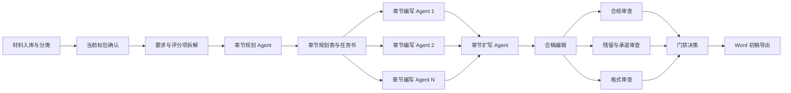

# 技术标编制 Subagent 工作台

这个仓库把技术投标文件编制拆成“总控 agent + 动态 subagent”的流水线。

核心原则不是让多个 agent 同时自由写作，而是先拆要求、再发任务书、并行写章节、独立审查、门禁通过后导出。

## 推荐流程



## 快速开始

1. 初始化一个项目工作区：

```powershell
python scripts/bidflow.py init "项目名称" --package "标包名称"
```

2. 将招标文件、技术规范书、历史参考和支撑材料放入生成的 `projects/<项目>/sources/` 对应目录。OpenClaw 快速验证阶段的知识管理规则放在 `technical-bid-authoring` skill 的 `references/knowledge-management.md` 下；历史材料采用人工粗筛、章节/段落片段登记、去项目化清洗、三态准入的受控复用方式，不单独建设复杂片段库或系统级知识库。

3. 编辑项目目录中的 `project.json`，补充材料和人工确认项，然后解析入库资料。`ingest-sources` 会读取 `sources/` 下的 PDF、DOCX、XLSX、TXT/MD，生成 `inventory/source-index.json` 和 `inventory/source-readiness.json`。PDF/DOCX/TXT 会尽量记录页码或章节路径，DOCX/XLSX 表格会记录表格位置；普通 PDF 表格暂不假定可稳定抽取，核心依据中的关键表格需要人工复核。

```powershell
python scripts/bidflow.py ingest-sources "projects/<项目目录>" `
  --report "projects/<项目目录>/reviews/ingest-sources.json"
```

系统按文件用途和解析可信度分级处理：技术规范书、评分细则、技术投标格式等核心依据不可稳定解析时阻断正文生成；历史技术标、既往方案和支撑材料解析质量较低时只降低引用优先级或排除出 RAG。

```powershell
python scripts/bidflow.py check-sources "projects/<项目目录>/inventory/source-readiness.json"
```

4. 生成 subagent 执行计划：

```powershell
python scripts/bidflow.py plan "projects/<项目目录>"
```

5. 检查逐条拆解的要求、标记和废标/否决条款：

如果要求拆解由 `requirement-analyst` 或外部 LLM 先产出为一个汇总 JSON，可先用 `shred-rfp` 将其落盘为标准台账并立即复用门禁校验：

```powershell
python scripts/bidflow.py shred-rfp `
  "projects/<项目目录>" `
  "projects/<项目目录>/requirements/shred-rfp.json" `
  --report "projects/<项目目录>/reviews/shred-rfp.json"
```

```powershell
python scripts/bidflow.py check-requirements "projects/<项目目录>/requirements/atomic-requirements.json"
```

推荐同时传入标记释义表和废标/否决条款表，执行交叉校验：

```powershell
python scripts/bidflow.py check-requirements `
  "projects/<项目目录>/requirements/atomic-requirements.json" `
  --markers "projects/<项目目录>/requirements/marker-register.json" `
  --rejections "projects/<项目目录>/requirements/rejection-clauses.json"
```

评分标准存在多组适用范围时，必须单独确认当前标包适用哪一组，不得把其他标包评分办法混入本标包：

```powershell
python scripts/bidflow.py check-scoring-applicability `
  "projects/<项目目录>/requirements/scoring-applicability.json" `
  --package "标包名称"
```

6. 章节规划完成后，先检查章节、评分项、原子要点和写作任务是否闭环，再派发 writer：

```powershell
python scripts/bidflow.py check-plan `
  "projects/<项目目录>/planning/chapter-plan.json" `
  --requirements "projects/<项目目录>/requirements/atomic-requirements.json" `
  --scoring-map "projects/<项目目录>/requirements/scoring-map.json" `
  --report "projects/<项目目录>/reviews/plan-check.json"
```

7. 按阶段运行门禁检查：

```powershell
python scripts/bidflow.py validate "projects/<项目目录>" --stage requirements
python scripts/bidflow.py validate "projects/<项目目录>" --stage planning
python scripts/bidflow.py validate "projects/<项目目录>" --stage export
```

章节扩写完成后，可检查结构、扩写比例及总结式段首段尾：

```powershell
python scripts/bidflow.py check-expansion "原章节.md" "扩写章节.md" --report "扩写审查.json"
```

## 为什么不按评分项一项一个 Agent

评分项与正文通常是多对多关系。一个章节可能覆盖多个评分项，同一个评分项也可能需要在方案、质量和服务章节中共同响应。

因此，本方案先生成 `requirements/scoring-map.json` 和 `requirements/format-rules.json`，再由 `chapter-planner` 输出 `planning/chapter-plan.json`。章节规划必须由三个因素共同决定：招标文件技术投标格式、技术评分项结构、单项评分内容体量。

当格式要求与评分项结构不一致时，以招标文件技术投标格式作为一级章节框架，以评分项作为章节内部展开依据。分值较高、内容范围较大的评分项，可在对应格式章节下拆成多个 writer 任务，避免单个 Writer 上下文过大、内容泛化或评分点遗漏。

## Agent 最小化原则

本工作台默认先用 schema、脚本和门禁处理确定性任务，只有章节编写、复杂合稿和跨章节整改才升级到 subagent。阶段复杂度与升级条件见 `config/minimalism-router.json`，复盘说明见 `docs/agent-minimalism-review.md`。

## 关键产物

- `project.json`：当前项目、标包、材料和人工确认状态。
- `state/workflow-state.json`：紧凑状态交接对象，只传项目状态、阶段、门禁和 artifact refs。
- `inventory/source-readiness.json`：材料可读性、抽取状态、转换状态和核心资料阻断项。
- `inventory/source-index.json`：资料解析索引，记录文本片段、页码、章节路径、段落序号和表格位置。
- `inventory/rag-fragments.json`：OpenClaw 快速验证阶段的历史材料候选片段、清洗后内容、风险标记和 `AVAILABLE`/`NEEDS_CONFIRMATION`/`DISABLED` 状态。
- `requirements/scoring-applicability.json`：多组评分标准的适用标包范围、当前标包选中组和人工确认状态。
- `requirements/scoring-map.json`：评分项到响应章节的映射。
- `requirements/shred-rfp.json`：可选的 RFP/招标文件拆解汇总输入，用 `shred-rfp` 落盘为标准台账。
- `requirements/atomic-requirements.json`：逐条原子要点台账，保留原文、来源、`*`、`⭐` 和废标/否决标记。
- `requirements/marker-register.json`：特殊标记及其文件内定义、确认状态。
- `requirements/rejection-clauses.json`：废标、否决、无效投标等阻断条款清单。
- `planning/chapter-plan.json`：章节规划表，锁定格式章节、评分项映射、技术要求映射和拆分依据。
- `reviews/plan-check.json`：规划覆盖检查结果，进入 writer 前必须处理阻断项。
- `templates/atomic-requirements.json`：逐条要点记录模板。
- `templates/marker-register.json`：`*`、`⭐` 等标记释义确认模板。
- `templates/rejection-clauses.json`：废标/否决条款汇总模板。
- `templates/chapter-plan.json`：章节规划表模板。
- `requirements/exclusion-list.json`：其他标包和禁用历史内容。
- `tasks/*.json`：发给各 subagent 的任务书。
- `chapters/*.md`：章节编写产物。
- `expanded/*.md`：严格保持原有分段结构的约 3 倍扩写稿。
- `reviews/*.json`：多轮审查结果和门禁结论。
- `output/`：仅在门禁通过后生成的 Word 初稿。

详细阶段定义见 `docs/process-spec.md`，实际派发方式见 `docs/orchestrator-runbook.md`，审查规则见 `docs/quality-gates.md`。
