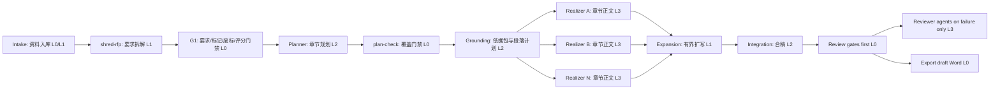

# 外部标杆吸收与可控多 Agent 完善计划

## 1. 吸收结论

外部 RFP/标书类项目和产品的共同点不是让一个 Agent 一次性完成投标文件，而是把高风险工作拆成可审计产物：要求拆解、合规矩阵、知识检索、带来源草稿、人工确认和导出门禁。

对本项目最有价值的吸收方向：

- `shred-rfp`：先把招标文件拆成原子要点、评分项、废标/否决条款、格式规则和排除项，不直接进入正文。
- `plan-check`：章节规划必须证明每个强制要求、评分项和废标响应位置都已覆盖，再生成章节依据包。
- 证据约束初稿生成：`content-grounder` 先把任务书转成章节依据包和段落计划，`chapter-realizer-*` 只接收这些受控产物、授权来源和清洗后的 RAG 片段；`chapter-writer-*` 仅作为兼容性别名。
- 人工闸门：标包、特殊标记含义、评分适用范围、废标/否决条款、技术偏差和导出前高风险问题必须人工确认。
- 最小充分 Agent：确定性检查走脚本；单次语义抽取走 L1；章节规划走 L2；章节正文和复杂整改才使用 L3 subagent。

## 2. 外部参考摘要

| 来源 | 看到的模式 | 对本项目的吸收 |
| --- | --- | --- |
| GitHub `run-llama/auto_rfp` | 上传 RFP、抽取问题、索引知识库、生成带来源答案 | 保留 `shred-rfp` + source trace，不允许无来源正文 |
| Microsoft RFP response accelerator | RFP 触发、知识库、proposal summary、project plan、confidence score、协作审查 | 增加置信度和人工确认字段，规划和审查分离 |
| OpenBidKit / 易标类项目 | 国内招投标语境、文档解析、知识复用、查重和废标检查 | 强化中文招标文件的废标/否决、标包适用和历史残留门禁 |
| ClawHub / SkillHub / agentskill.sh 相关 skill | 多数是轻量 proposal responder 或 ingest skill | 只吸收角色和模板，不引入不受控外部 skill 执行写作 |
| Reddit / Product Hunt / X 社区讨论 | 用户痛点集中在 compliance matrix、RFP shredding、避免幻觉、来源引用和人工协作 | 产品优先级放在拆解、覆盖、来源和人工闸门，而不是全自动生成 |

## 3. 推荐可控多 Agent 架构

## 4. Agent Minimalism 分级表

| 阶段 | 等级 | 执行者 | 为什么 |
| --- | --- | --- | --- |
| 资料入库 | L0 默认，失败升 L1 | 清单/脚本，必要时 `intake-librarian` | 文件存在、类型、解析状态可规则化；混杂标包和版本冲突才需要语义判断 |
| RFP shredding | L1 | `requirement-analyst` + `shred-rfp` | 需要语义抽取，但输出是固定 schema，落盘后由脚本校验 |
| 要求门禁 | L0 | `check-requirements` 等脚本 | 特殊标记、废标、交叉引用和评分适用可结构化检查 |
| 章节规划 | L2 | `chapter-planner` | 需要在投标格式、评分项和技术规范之间做证据约束规划 |
| 规划门禁 | L0 | `check-plan` | 覆盖率、重复输出、未知引用和强制项遗漏可确定性检查 |
| 章节依据构造 | L2 | `content-grounder` | 在固定 schema 中绑定评分原文、项目事实、知识卡、来源和废标边界，不生成正文 |
| 章节初稿生成 | L3 | `chapter-realizer-*` | 初稿生成有开放表达和证据选择，适合窄写入 subagent；不承担扩写深化职责 |
| 扩写 | L1 | `chapter-expander-*` | 有固定输入输出和结构比例要求，不允许自由新增事实 |
| 合稿 | L2 | `integration-editor` | 需要跨章节去重、衔接和口径统一 |
| 审查 | L0 默认，失败升 L3 | 门禁脚本，必要时 reviewer | 先脚本定位风险，再让 Agent 做语义解释和整改建议 |
| 导出 | L0 | exporter 脚本 | 高风险未关闭时阻断，保持 draft_only |

## 5. 已落地到仓库的新增执行点

- `python scripts/bidflow.py shred-rfp <project_dir> <shred_file>`：把外部抽取或 `requirement-analyst` 的汇总结果落盘为标准 `requirements/*.json`，并复用要求、标记、废标交叉门禁。
- `python scripts/bidflow.py check-plan <chapter-plan.json> --requirements <atomic-requirements.json> --scoring-map <scoring-map.json>`：检查章节规划是否覆盖强制/必答要点、评分项和写作任务。
- `check-grounding-pack` 与 `check-paragraph-plan --grounding`：检查项目事实、评分对象、动作、控制点、交付成果、来源和废标边界是否足以支撑真实正文。
- `check-chapter-draft`：同时读取任务书、依据包、段落计划和 evidence，检查真实落位、禁用词、空话和逐项来源。
- `check-rejection`：在初稿、扩写稿和合稿阶段重复检查废标/否决风险。
- `validate --stage grounding/drafting/expansion/review/export`：沿每个任务书实际重跑门禁，不再只检查产物是否存在。

## 6. 下一步完善计划

### Phase 1: Schema 与样例项目

- 为 `shred-rfp.json`、`scoring-map.json`、`format-rules.json`、`mandatory-requirements.json` 补齐模板。
- 增加一个最小样例项目，演示从 `shred-rfp` 到 `check-plan` 的完整通过路径。
- 将关键字段分为 `agent_extracted`、`human_confirmed`、`gate_status` 三类，便于人工控制。

### Phase 2: 文档解析 MVP

- 增加 `ingest-sources`：登记 PDF/DOCX/XLSX、解析文本、页码、表格和章节路径。
- 对扫描件、加密文件、旧版 DOC 和表格抽取失败建立降级策略。
- 输出 `inventory/source-index.json`，为 `shred-rfp` 提供片段引用。

### Phase 3: RFP Shredding 增强

- 将招标文件按章节、表格、附件、脚注拆片。
- 生成 compliance matrix：要求、来源、响应章节、证据、状态、人工确认。
- 对废标/否决条款单独加阻断状态，不和普通要求混在一起。

### Phase 4: 规划与写作控制

- 扩展 `check-plan`：检查任务文件是否与 `chapter-plan.json` 一致。
- 为每个初稿生成任务加入 allowed sources、forbidden content、expected evidence。
- 只允许 `chapter-realizer-*` 写入授权章节和证据文件。

### Phase 5: 审查与导出

- 增加 `check-traceability`：正文每个承诺可追溯到要求或来源。
- 增加 `check-residue`：历史项目、其他标包、客户名、采购编号残留检测。
- Word 导出前必须通过 `requirements`、`planning`、`review` 三层门禁，并保留初稿标记。

## 7. 安全边界

外部 skill 可以参考，但不应直接信任。引入任何 skill 前必须确认：

- 是否限制写入目录。
- 是否会读取完整历史聊天或无关本地文件。
- 是否允许未经清洗的历史材料进入正文。
- 是否保留来源引用和人工确认字段。
- 是否能被本仓库的 L0 门禁复核。
