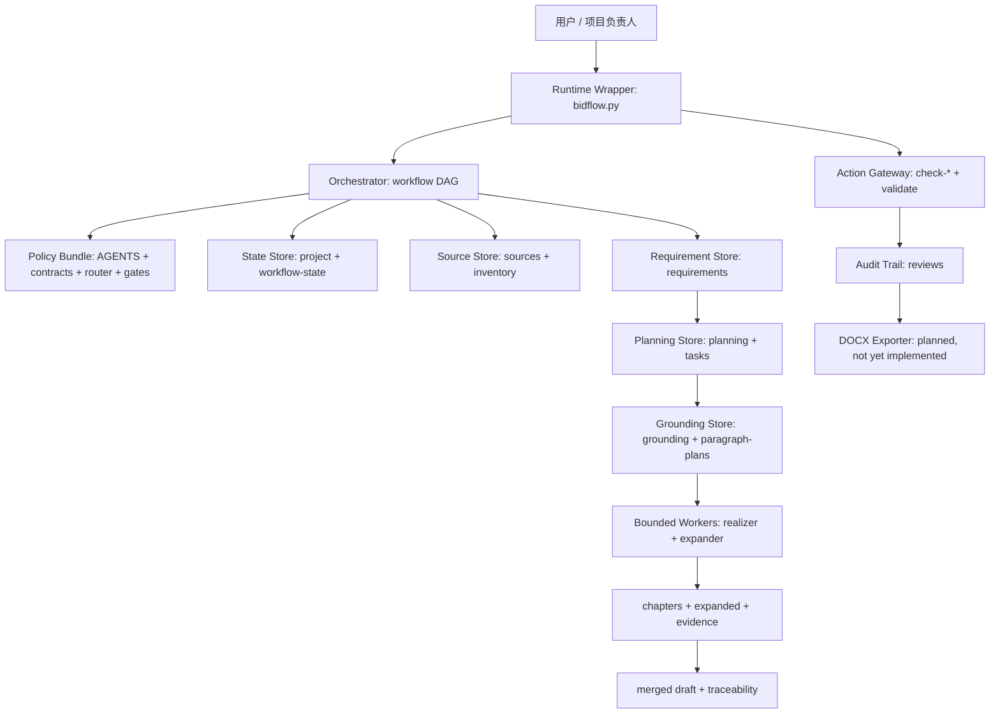

# 技术标编制 Agent 产品化规范

> 版本：2026-06-30 校准版
> 参考来源：外部产品化规范文档
> 本文只描述当前仓库可验证事实与近期产品化方向，不替代投标终审，也不声明任何项目已经具备正式交付条件。

## 1. 产品定义

**产品名称**：技术标编制 Agent 工作台

**产品类别**：面向技术投标文件的受控生成型工作流内核。系统由确定性脚本、固定阶段编排、有边界 subagent、结构化状态和人工门禁组成，不是单个自由写作助手。

**一句话定义**：在当前项目、当前标包、评分边界和技术标格式已经确认的前提下，将招标文件、技术规范、评分规则、历史参考和支撑材料转换为可追溯的要求台账、我司响应口径、章节任务、章节初稿、扩写稿、审查报告和待导出的 Word 初稿。

**当前成熟度**：CLI/JSON 工作流内核已经形成；真实项目运行日志、统一审查报告 schema、完整 DOCX 导出器和 Web 工作台仍需建设。

## 2. 产品目标

| 目标 | 产品含义 | 当前支撑 |
| --- | --- | --- |
| 不漏项 | 要求、评分对象、格式要求、废标/否决条款逐条进入台账 | `shred-rfp`、`check-requirements`、`check-plan` |
| 不串标包 | 评分项只能来自当前标包已确认评分组组合 | `scoring-applicability.json`、`check-scoring-applicability` |
| 不乱承诺 | 招标原文先转换为已确认我司响应口径，正文不得扩大范围 | `response-register.json`、`check-response-register`、`check-responses` |
| 正文真实展开 | 章节先规划、再依据化、再写主体、再扩细节 | `chapter-plan`、`grounding-pack`、`paragraph-plan`、realizer、expander |
| 可追溯 | 事实、评分响应和履约口径可回溯到来源和结构化 ID | `source-index.json`、evidence、`traceability.json` |
| 可并行 | 写作任务按响应章节动态创建，写入范围互不重叠 | `chapter-task-*.json`、`chapter-realizer-*` |
| 可审查 | 每个阶段先跑确定性检查，再按需升级 reviewer | `check-*`、`validate`、`minimalism-router.json` |

## 3. 非目标

- 不编制商务标、报价标或资格审查资料。
- 不替代技术负责人、项目负责人、法务和最终投标责任人的人工判断。
- 不自动确认负偏差，不把未确认事项写成确定性承诺。
- 不把历史项目名称、客户、人员、周期、业绩或专属承诺直接迁移到当前项目。
- MVP 阶段不建设复杂知识库、真实向量召回系统或多人协同平台。
- 不自动上传外部电子投标平台。
- 当前不宣称已经具备完整 DOCX 导出闭环。

## 4. 当前实现事实

### 4.1 运行入口

当前入口为 `scripts/bidflow.py`，共有 18 个子命令：

| 类型 | 命令 |
| --- | --- |
| 项目与材料 | `init`、`plan`、`ingest-sources`、`check-sources` |
| 要求与评分 | `shred-rfp`、`check-requirements`、`check-scoring-applicability`、`check-scoring-map`、`check-response-register` |
| 规划与依据 | `check-plan`、`check-grounding-pack`、`check-paragraph-plan` |
| 正文与风险 | `check-chapter-draft`、`check-responses`、`check-expansion`、`check-rejection` |
| 总门禁与治理 | `validate`、`review-minimalism` |

### 4.2 九阶段工作流

| 阶段 | 最低充分等级 | 主执行者 | 关键输出 | 核心门禁 |
| --- | --- | --- | --- | --- |
| `intake` | L0 | 脚本，异常时 `intake-librarian` | 来源索引、可读性、RAG 片段 | G0 材料可读、项目与标包确认 |
| `requirements` | L1 | `requirement-analyst` | 原子要求、评分边界、评分映射、响应口径 | G1 标记、废标项、评分组组合和响应口径确认 |
| `planning` | L2 | `chapter-planner` | 章节规划、映射、写作任务书 | G2 一级守格式、二级守评分、三级对应评分原文 |
| `grounding` | L2 | `content-grounder` | 章节依据包、段落计划 | G2 评分、项目事实、响应口径和来源均绑定 |
| `drafting` | L3 | `chapter-realizer-*` | 章节初稿、evidence | G3 标题树、评分点、响应口径和证据真实落位 |
| `expansion` | L1 | `chapter-expander-*` | 结构不变的扩写稿 | G3 不新增事实、不改变响应范围和承诺强度 |
| `integration` | L2 | `integration-editor` | 合稿、追溯表 | G3 章节齐全、术语和口径一致 |
| `review` | L0 | 脚本优先，必要时 reviewers | 审查与整改报告 | G4 高风险清零、中风险人工决定 |
| `export` | L0 | `exporter` 契约 | Word 初稿 | G5 `draft_only=true`、人工复核；实现仍待补齐 |

### 4.3 当前规模

| 指标 | 当前值 | 核验方式 |
| --- | ---: | --- |
| 工作流阶段 | 9 | `config/workflow.json` |
| CLI 子命令 | 18 | `scripts/bidflow.py` AST 扫描 |
| 模板文件 | 16 | `templates/` 文件统计 |
| 自动化测试 | 60 passed | `python -m unittest tests.test_bidflow` |
| 最小化治理 | PASS | `python scripts/bidflow.py review-minimalism` |
| Git 工作区 | 可用、存在未提交改动 | `git status --short` |
| 可解析格式 | PDF、DOCX、XLSX、TXT、MD | 来源解析函数和测试 |

这些数字是代码能力指标，不代表真实标书质量、项目完成数量或投标成功率。

## 5. 产品架构



| 架构角色 | 当前实现 |
| --- | --- |
| Scheduler | 无常驻调度器；由人工或外部运行时触发 |
| Runtime Wrapper | `python scripts/bidflow.py ...` |
| Orchestrator | `config/workflow.json` 定义固定 DAG |
| Complexity Router | `config/minimalism-router.json` |
| Worker Contract | `config/agent-contracts.json` |
| State Store | `project.json`、`state/workflow-state.json`、artifact refs |
| Action Gateway | `check-*` 与分阶段 `validate` |
| Audit Trail | `reviews/*.json`、evidence、`merged/traceability.json` |
| Recovery | 回退到最小受影响阶段；关键基线变化触发全量复审 |

## 6. 核心数据契约

### 6.1 评分边界

`requirements/scoring-applicability.json` 不再假定当前标包只能选择一个评分组。它支持：

- `GLOBAL_COMMON`：全项目通用评分组。
- `PACKAGE_COMMON`：若干标包共用评分组。
- `PACKAGE_SPECIFIC`：标包专项评分组。
- `ADDENDUM_OVERRIDE`：补遗或澄清覆盖组。

每个评分项必须绑定已选中的 `scoring_group_id` 和 `source_segment_id`。来源片段可以使用 PDF 页区间、Word 章节/表格、Excel 区域或切片 ID 定位；被排除、冲突或被覆盖的评分组不得进入章节规划。

### 6.2 要求—我司响应口径

`requirements/response-register.json` 将招标原文和投标正文口径分开保存：

- 供应商义务：`我司将……`
- 采购方义务：`我司理解并配合采购方……`
- 禁止性要求：`我司承诺不……`
- 评分期待：形成具体方案、措施和证据，不擅自升级为额外履约义务。

`fixed_elements` 锁定责任主体、条件、范围、数字、单位和承诺强度；`allowed_expansion` 限定可增加的执行细节；`forbidden_changes` 阻止范围扩大和责任转移。evidence 不能代替正文实际写出已确认的 `canonical_response`。

### 6.3 真实展开链

```text
scoring-applicability + response-register
  -> chapter-plan
  -> chapter-task
  -> grounding-pack
  -> paragraph-plan
  -> chapter-realizer
  -> check-chapter-draft + check-responses + check-rejection
  -> chapter-expander
  -> check-expansion + check-responses + check-rejection
  -> integration-editor
```

`chapter-realizer-*` 负责主体初稿，`chapter-expander-*` 只负责细节加厚。两者不得合并为页级模板轮转生成器。

## 7. 输入与输出模型

### 7.1 输入

| 输入 | 路径 | 必要性 | 处理原则 |
| --- | --- | --- | --- |
| 项目与标包 | `project.json` | 必需 | 未人工确认不得进入正文 |
| 招标文件 | `sources/tender/` | 必需 | 核心依据不可读时阻断 |
| 技术规范 | `sources/technical-specification/` | 必需 | 核心依据不可读时阻断 |
| 评分与格式 | 来源索引和 `requirements/` | 必需 | 按逻辑片段和标包边界隔离 |
| 历史技术标 | `sources/historical-reference/` | 可选 | 去项目化、残留检测、三态准入 |
| 支撑材料 | `sources/supporting-material/` | 可选 | 可作证据或方法参考，不自动形成承诺 |
| 人工决策 | 确认字段和审查记录 | 必需 | 偏差、标记、评分边界、响应口径不得自动确认 |

### 7.2 输出

| 输出类型 | 主要路径 |
| --- | --- |
| 材料状态与索引 | `inventory/source-readiness.json`、`inventory/source-index.json` |
| 历史片段准入 | `inventory/rag-fragments.json` |
| 要求与风险 | `atomic-requirements.json`、`marker-register.json`、`rejection-clauses.json` |
| 评分与响应 | `scoring-applicability.json`、`scoring-map.json`、`response-register.json` |
| 章节规划与任务 | `planning/chapter-plan.json`、`tasks/chapter-task-*.json` |
| 写作依据 | `grounding/*.json`、`paragraph-plans/*.json` |
| 正文和证据 | `chapters/*.md`、`expanded/*.md`、`evidence/*.json` |
| 合稿和追溯 | `merged/technical-bid-draft.md`、`merged/traceability.json` |
| 审查 | `reviews/*.json` |
| 目标导出物 | `output/技术投标文件-初稿.docx`，当前仅有契约，缺少完整导出实现 |

## 8. 幂等、状态与写入所有权

| 对象 | 建议幂等键 |
| --- | --- |
| 项目隔离 | `project_id/package_id`；当前兼容 `project_name/package_name` |
| 来源 | `source_id + version/content_hash` |
| 来源片段 | `source_id + segment_id` |
| 原子要求 | `requirement_id + source_ref + original_text_hash` |
| 响应口径 | `response_item_id + requirement_id` |
| 评分项 | `scoring_group_id + scoring_item_id + source_segment_id` |
| 章节任务 | `task_id + output_file + chapter_plan_version` |
| 审查报告 | `check_type + artifact_hash + policy_version` |

| 写入对象 | Mutation Owner |
| --- | --- |
| 项目目录与快照 | `bidflow.py init` |
| 来源索引与可读性 | `ingest-sources`；复杂异常可升级 `intake-librarian` |
| 要求、评分和响应台账 | `shred-rfp`、`requirement-analyst` |
| 章节规划和任务 | `chapter-planner` |
| 依据包和段落计划 | `content-grounder` |
| 章节和 evidence | 对应 `chapter-realizer-*` |
| 扩写稿 | 对应 `chapter-expander-*` |
| 合稿和追溯 | `integration-editor` |
| 审查报告 | 确定性检查器；必要时对应 reviewer |
| Word 初稿 | 未来 `exporter` 实现，受 G5 控制 |

subagent 交接只传 `state/workflow-state.json`、任务书和授权 artifact refs，不默认复制整份招标文件、历史材料或完整聊天记录。

## 9. 失败与恢复语义

| 失败模式 | 级别 | 恢复位置 |
| --- | --- | --- |
| 当前标包或技术格式未确认 | BLOCKER | G0 项目基线 |
| 核心依据不可稳定解析 | BLOCKER | 材料转换或人工摘录 |
| `*`/`⭐`、废标后果或适用范围不明 | BLOCKER | requirements |
| 评分项来自未选中/已排除/被覆盖组 | BLOCKER | scoring applicability/map |
| 必答要求无已确认我司响应口径 | BLOCKER | response register |
| 章节目录未对应评分原文 | BLOCKER/CRITICAL | chapter planner |
| grounding 或段落计划改变中央口径 | BLOCKER | content grounder |
| 正文用 evidence 代替实际响应 | BLOCKER | chapter realizer |
| 扩写改变条件、范围、数字或责任主体 | BLOCKER | chapter expander |
| 合稿引用断链或跨章节口径冲突 | CRITICAL/BLOCKER | integration editor |
| 高风险未关闭即导出 | BLOCKER | review/export gate |

默认只回退到最小受影响阶段。项目、标包、评分组、废标条款、偏差或响应口径发生变化时，必须重新执行受影响链路，必要时全量复审。

## 10. 可观测性与产品指标

当前观测面包括：命令 JSON 输出、阶段缺失文件、门禁报告、evidence、traceability 和自动化测试。

建议统一沉淀以下 durable metrics：

| 指标 | 建议来源 | 产品用途 |
| --- | --- | --- |
| requirement count / coverage | 原子要求与 `check-plan` | 判断拆解工作量与漏项风险 |
| scoring coverage | scoring map、chapter plan | 判断评分响应完整度 |
| response confirmation rate | response register | 判断 G1 人工确认瓶颈 |
| response drift count | `check-responses` | 判断正文和扩写范围漂移 |
| high-risk open count | `reviews/*.json` | 控制导出风险 |
| gate failure distribution | `validate` | 判断流程主要阻塞点 |
| human confirmation latency | 决策时间戳 | 判断协作效率 |
| historical fragment status | RAG 三态分布 | 判断知识复用成熟度 |
| tokens / duration by stage | 运行日志 | 判断 Agent 成本与性能 |

当前尚无统一 run-log、事件时间戳和真实项目指标聚合，不能据此计算投标效率提升或成功率。

## 11. 安全与人工责任

- 内容边界：只处理技术标。
- 写入边界：每个 subagent 只写任务书授权文件。
- 来源边界：只读取当前任务授权来源。
- 历史材料边界：只能使用清洗后且准入的片段。
- 评分边界：只使用已确认评分组组合。
- 响应边界：正文只使用已确认 `response_item_id`，不改变固定要素。
- 导出边界：高风险未清零不得生成 Word；最终导出必须标注初稿/待复核。
- 人工责任：标包、特殊标记、废标条款、响应口径、偏差、中风险处置和最终导出许可均需人工决定。

## 12. 产品化治理路线

| 优先级 | 治理项 | 理由 |
| --- | --- | --- |
| P0 | 实现并测试完整 DOCX 导出器 | 当前只有 exporter 契约和输出路径，尚无闭环实现 |
| P0 | 建立小型端到端 demo project | 验证从 `init` 到 G5 的真实 artifact 链 |
| P0 | 统一所有门禁报告 schema | 支撑 Web 化、指标聚合和问题定位 |
| P0 | 建立 run-log 和 policy/artifact 版本记录 | 支撑可观测性、幂等和变更追踪 |
| P1 | 将 `project_id/package_id` 升为稳定隔离键 | 降低名称变化和同名项目风险 |
| P1 | 增加补遗影响分析和失效传播 | 自动标记需重做的评分、任务、正文和审查 |
| P1 | 增强历史残留扫描 | 把现有规则进一步变为确定性检测 |
| P1 | 增加依赖可用性和扫描件 OCR 降级诊断 | 提升材料门禁可解释性 |
| P2 | 封装服务 API | 为 Web 工作台提供稳定后端 |
| P2 | 建设人工确认 UI | 减少 JSON 手填和状态误操作 |
| P2 | 建设指标面板 | 展示覆盖、阻断、确认延迟和成本 |

## 13. 成功标准

| 层级 | 成功标准 |
| --- | --- |
| 工作流成功 | 一个真实项目从材料入库、要求拆解、目录规划、依据构造、初稿、扩写、合稿、审查到 draft-only Word 跑通 |
| 质量成功 | 强制要求、评分项、废标条款和响应口径均有正文落点与证据链 |
| 安全成功 | 无跨标包污染、历史残留、无依据承诺、范围扩大和人工门禁绕过 |
| 产品成功 | 售前人员可稳定得到可审阅初稿，负责人可快速定位风险和来源 |
| 工程成功 | 关键 schema、CLI、门禁、恢复和导出链路均有自动化测试和结构化日志 |

## 14. 简版 Spec 卡片

| 项 | 内容 |
| --- | --- |
| Trigger | 人工或外部运行时执行 `bidflow.py` / `technical-bid-authoring` skill |
| Input | 项目目录、招标文件、技术规范、评分规则、历史材料、支撑材料、人工确认 |
| Output | 要求与响应台账、章节规划、任务、依据包、正文、扩写、合稿、审查报告、目标 Word 初稿 |
| Idempotency | `project/package + source/requirement/response/scoring/task IDs + artifact hash` |
| Mutation Owner | CLI 脚本和按任务书授权的 subagent |
| Safety Boundary | 只做技术标初稿；评分和响应边界已确认；高风险未关闭不导出 |
| Recovery | 回到最小受影响阶段；关键基线变化触发受影响链路复审 |
| Current Maturity | 可验证 CLI/JSON 内核；真实项目 run-log、统一报告、DOCX 导出和 Web UI 待建设 |
